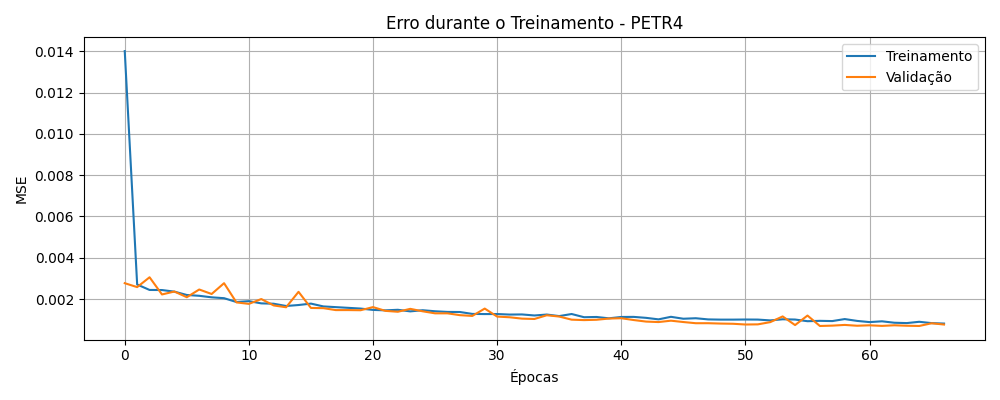

# 📊 Intelligent Stock Predictor - LSTM Univariado & Multivariado

Este projeto tem como objetivo a construção de modelos de machine learning capazes de prever o comportamento de ativos financeiros com base em séries temporais. Utilizando arquiteturas LSTM (Long Short-Term Memory), o sistema foi projetado para analisar históricos de preços e gerar previsões para prazos variados.

---

## 🎯 Objetivos

- Criar um sistema inteligente que:
  - Preveja o fechamento do preço de ações para o **próximo dia útil**;
  - Valide as previsões com os dados reais de teste;
  - Projete **cenários futuros para 30 e 60 dias** com base no comportamento atual do mercado;
  - Compare abordagens **univariadas** (apenas fechamento) e **multivariadas** (com indicadores técnicos).

---

## 🧠 Modelos treinados

### 🔹 LSTM Univariado
- Entrada: Fechamento dos últimos 60 dias
- Previsão: Fechamento do próximo dia
- Arquivo: `model_lstm_univariado.keras`

### 🔸 LSTM Multivariado (Aprimorado)
- Entrada: 
  - `Fechamento`
  - `Retorno_%` (variação percentual)
  - `MM9` (média móvel de 9 dias)
  - `RSI` (indicador de momentum)
- Previsão: Fechamento do próximo dia
- Arquivo: `model_lstm_multivariado.keras`

---

## 🧪 Validação e Comparativos

As validações utilizam o conjunto de teste, comparando previsões com valores reais e gerando métricas:

- **RMSE** (erro quadrático médio)
- **MAE** (erro absoluto médio)
- _(em desenvolvimento)_ **MAPE**, **R²**, análise de resíduos e intervalo de confiança

### 🔍 Gráficos gerados:

- `comparativo_teste_multivariado.png` → Comparativo completo real x previsto
- `validacao_e_previsao_30_dias_multivariado.png` → 30 dias reais + 30 dias futuros
- `treinamento_multivariado.png` → Curvas de perda no treinamento do modelo

### 📈 Exemplos visuais

#### 🧠 Curva de Treinamento (Loss por época)
  
> A curva de perda mostra uma queda rápida e estabilização, indicando bom aprendizado sem overfitting.

#### 🧪 Comparação Real x Previsto
  
> O modelo capturou com precisão a dinâmica dos preços históricos, mesmo durante períodos de forte volatilidade.

---

## 📁 Estrutura dos arquivos

```
.
├── core/
│   ├── data_preprocessing_multivariado.py
│   ├── model_lstm_multivariado.py
│   └── predictor_multivariado.py
│
├── training_multivariado.py
├── validar_e_prever_30_dias.py
├── run_inference.py
├── comparar_modelo.py
├── requirements.txt
├── README.md
└── app.py (interface interativa)
```

---

## ▶️ Como executar

1. Instale dependências:
```bash
pip install -r requirements.txt
```

2. Execute o treinamento multivariado:
```bash
python run_training_multivariado.py
```

3. Compare previsões com dados reais:
```bash
python compara_multivariado.py
```

4. Visualize a tendência futura:
```bash
python predict_validated_30dias_multivariado.py
```

---

## 💡 Dicas de uso

- Substitua os arquivos `.csv` em `data/raw/` com históricos reais de qualquer papel de ação
- Os modelos serão automaticamente treinados com base nesses dados
- Resultados e gráficos serão salvos na pasta `results/`

---

## 📝 TODOs (em andamento)

### 🔍 Aferição e Métricas:
- [ ] Implementar **MAPE** (Erro Percentual Absoluto Médio)
- [ ] Adicionar **R² (Coeficiente de Determinação)**
- [ ] Gerar gráfico de **resíduos (erro real - previsto)**
- [ ] Avaliar consistência das previsões para extremos de mercado

### 📈 Previsão Futura (30 dias):
- [ ] Remover ou suavizar **limites artificiais de clipping**
- [ ] Usar **múltiplas amostras (Monte Carlo)** para intervalo de confiança
- [ ] Ajustar mecanismo de atualização da sequência (melhor memória recorrente)
- [ ] Considerar `stateful=True` com manutenção de estado entre previsões futuras

---

## 🧠 Autor & Licença

Desenvolvido por [Izael Castro] — Repositório educativo/pessoal  
Licença: MIT

## 📬 Contato
Izael Castro  
Email: izaeldecastro@gmail.com  
GitHub: Iz-castro
