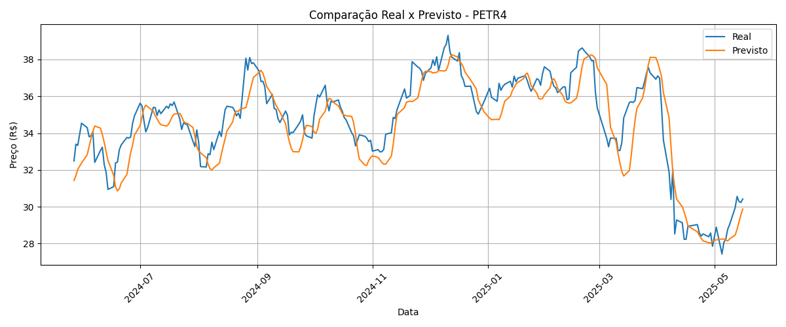
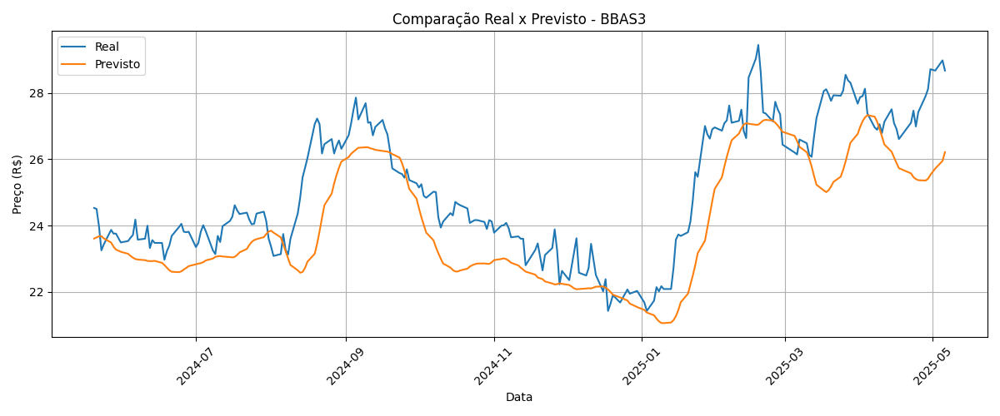
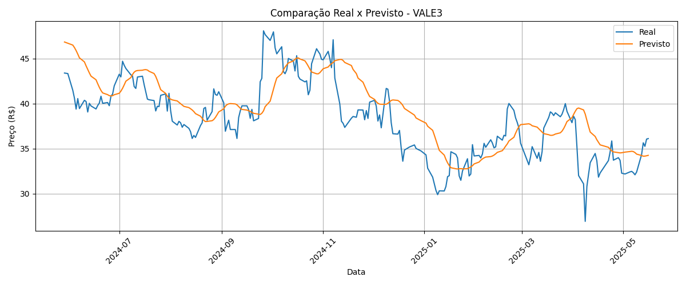

# 📈 Intelligent Stock Predictor (Multivariate LSTM)

This project aims to forecast the closing prices of Brazilian stocks using multivariate time series processed by LSTM neural networks. The model is trained individually for each asset using historical data obtained from *br.investing.com*, and the application features graphical visualizations and an interactive Gradio interface.

---

## ⚠️ DISCLAIMER

This project is for educational and research purposes only. It does not constitute financial advice or recommendations. Use of the predictions generated by this model in any investment or trading decision is done at your own risk.

The author assumes no responsibility or liability for any losses incurred as a result of using this software. Always consult a qualified financial advisor before making investment decisions.

---

## 🎯 Objective

Develop a modular and intelligent system that:
- Predicts the **next trading day's** closing price based on the past 60 days;
- Compares predictions with actual test data;
- Projects **future trends for 30 and 60 business days**;
- Supports interactive usage with CSV file upload via Gradio;
- Is easily auditable and updatable.

---

## 🧠 Model Architecture

### 🔸 Multivariate LSTM
- **Input Features:**
  - `Closing Price`
  - `Return_%`
  - `MM9` (9-day moving average)
  - `RSI` (Relative Strength Index)
- **Prediction:** Closing price for the next business day
- **Model File:** `model_lstm_multivariado.keras`

The architecture consists of **three sequential LSTM layers** with **progressive Dropouts** to avoid overfitting, followed by a final dense layer that outputs the predicted closing price. 
The network is optimized using the **Adam optimizer** with a reduced learning rate to ensure training stability.

---

## 📊 Quantitative Results

| Ticker | RMSE  | MAE   | Last Evaluation       |
|--------|-------|-------|------------------------|
| PETR4  | 1.52  | 1.11  | 2025-05-15 22:10:03     |
| BBAS3  | 1.22  | 0.95  | 2025-05-16 10:37:42     |
| VALE3  | 1.73  | 1.28  | 2025-05-16 11:02:25     |


> Metrics were calculated using the test set (20%) and saved in `results/metricas_modelos.csv`.

---

## 📉 Comparison Graphs

### 🔹 Actual vs Predicted:
- 
- 
- 

### 🔹 Training Curves:
- `treinamento_multivariado_PETR4.png`
- `treinamento_multivariado_BBAS3.png`
- `treinamento_multivariado_VALE3.png`

### 🔮 Future Projections:
- `validacao_e_previsao_30_dias_multivariado.png`
- `previsao_60_dias.png`

---

## 📦 Project Structure

```
.
├── core/
│   ├── data_preprocessing_multivariado.py
│   ├── model_lstm_multivariado.py
│   ├── predictor_multivariado.py
├── data/raw/
├── models/
├── results/
├── utils/
│   └── metrics.py
├── train_multivariado.py
├── compara_modelo.py
├── validar_e_prever_30_dias.py
├── app.py
├── requirements.txt
├── README.md
```

---

## 🔧 How to Run Locally

1. Clone the repository:
```bash
git clone https://github.com/Iz-castro/intelligent-stock-predictor.git
cd intelligent-stock-predictor
```

2. Create and activate a virtual environment:
```bash
python -m venv venv
source venv/bin/activate  # Linux/Mac
venv\Scripts\activate     # Windows
```

3. Install dependencies:
```bash
pip install -r requirements.txt
```

4. Train the model:  
  (Optional — the training can also be triggered directly from `app.py`)
```bash
python train_multivariado.py
```

5. Generate comparisons and forecasts:
  (Optional — the training can also be triggered directly from `app.py`)
```bash
python compara_modelo.py
python validar_e_prever_30_dias.py
```

6. Launch the interactive app:
```bash
python app.py
```

---

## 🌐 Web Application

The project uses **Gradio** to provide an interactive interface for:
- Uploading `.csv` files;
- Training with multiple assets;
- Viewing metrics and charts;
- Making predictions with updated data.

> 💡 Hosting planned for HuggingFace Spaces or Streamlit Cloud.

---

## 🔍 Data Source

- Data was manually obtained from: https://br.investing.com/
- 🚧 TODO: Replace with automated API ingestion (e.g., Alpha Vantage, Twelve Data, or official B3 API)

---

## 📢 Contact & Credits

Developed by **Izael Castro**  
📬 Email: *izaeldecastro@gmail.com*  
🔗 GitHub: [Iz-castro](https://github.com/Iz-castro)  
🔗 LinkedIn: [www.linkedin.com/in/izcastro](https://www.linkedin.com/in/izcastro)

> 🇧🇷 Para ler esta documentação em português, acesse [README_PT-BR.md](README_PT-BR.md)
---

## 📜 License

This project is licensed under the Apache License.  
See the `LICENSE` file for more details.
