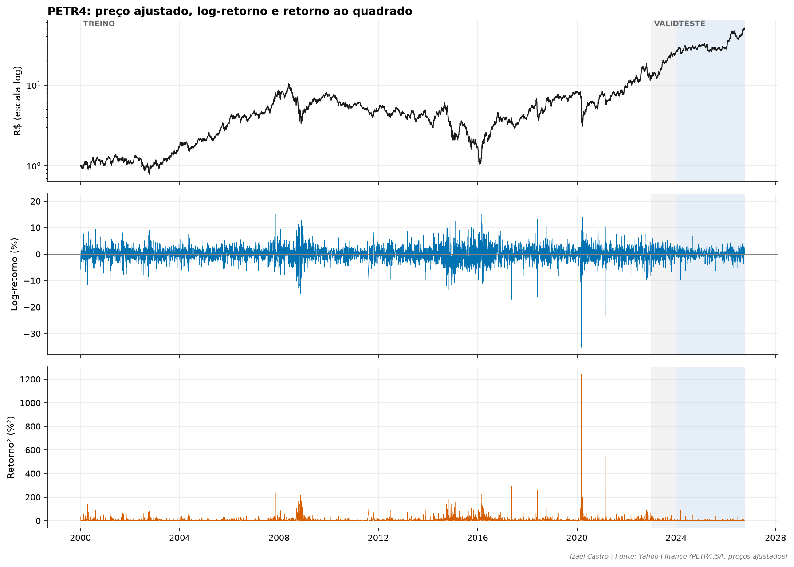
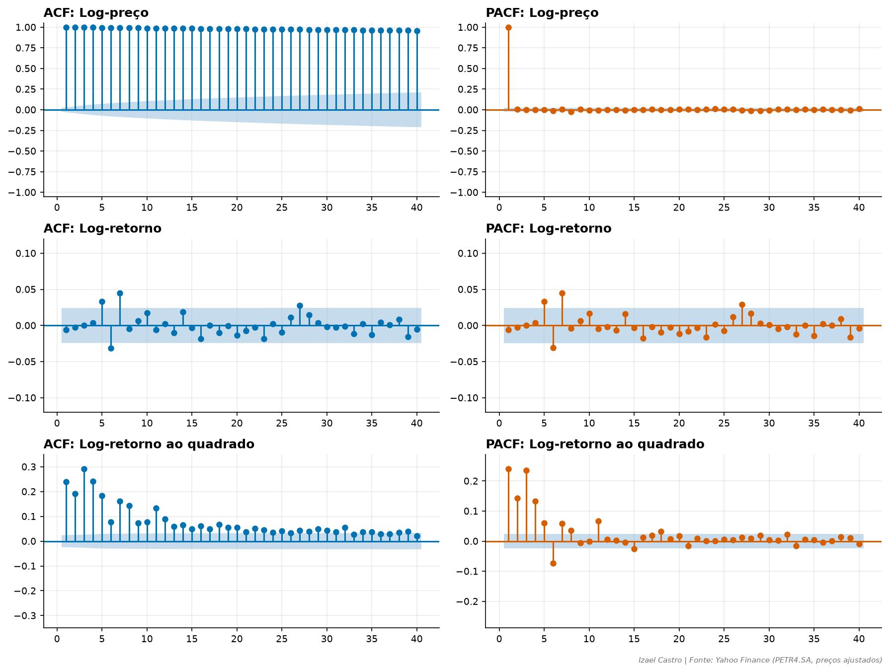
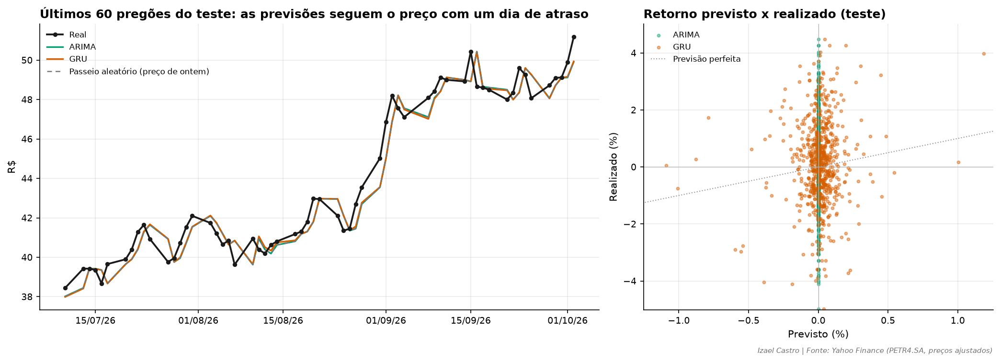
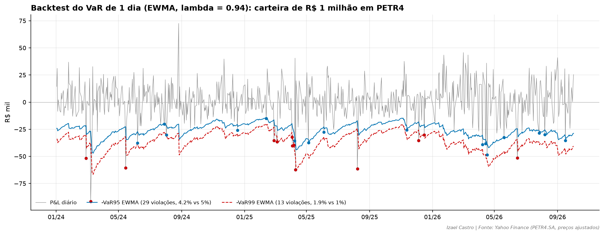
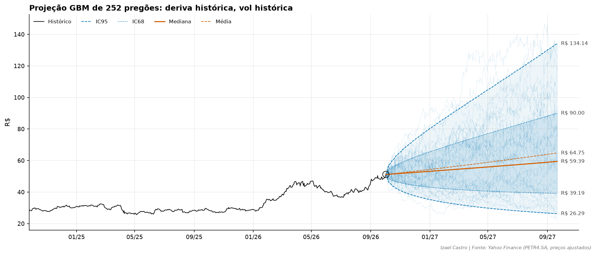

# Intelligent Stock Predictor: PETR4

Estudo de previsão e risco da PETR4 com séries temporais, reconstruído a partir da versão anterior deste repositório (LSTM e GRU multivariadas sobre o preço de fechamento) para a disciplina de Aplicações em Finanças, Controladoria e Compliance do MBA em Inteligência Artificial e Analytics da FGV. A pergunta que orienta o projeto é a mesma que levei à primeira aula: se o preço de uma ação se comporta como passeio aleatório, o que um modelo de aprendizado profundo consegue extrair dele além da persistência? Para respondê-la, coloquei a rede lado a lado com o passeio aleatório e com um ARIMA, no mesmo período de teste e sob os mesmos testes estatísticos, e acrescentei as duas ferramentas de risco discutidas na última aula, o VaR por volatilidade EWMA (RiskMetrics) e a projeção por Movimento Browniano Geométrico.

> **Aviso.** Projeto de caráter educacional. Nada aqui constitui recomendação de compra ou venda de ativos, e o autor não se responsabiliza por decisões tomadas com base nos resultados.

## Por que o projeto mudou

Na versão anterior, a GRU prevendo o preço do pregão seguinte chegou a um RMSE de 0,5373 no teste, contra 0,5377 do modelo ingênuo que apenas repete o preço do dia anterior, com R² de 0,996 e acerto direcional de 51,3%. O R² alto parecia indicar um bom modelo, mas qualquer previsão próxima do último preço observado alcança esse valor em uma série com raiz unitária, porque o preço de hoje já explica quase toda a variância do preço de amanhã. A rede tinha aprendido a persistência, e o acerto direcional próximo de 50% confirmava que ela não antecipava o movimento. Diante disso, troquei o alvo pelo log-retorno, que é estacionário, e passei a medir o desempenho sempre em relação ao passeio aleatório, que é a referência que um modelo de preço precisa superar para justificar sua existência.

Ao revisar o código antigo, encontrei também problemas de vazamento de informação que tornavam as métricas otimistas, descritos na seção [Correções em relação à versão anterior](#correções-em-relação-à-versão-anterior).

## O que o estudo faz

O fluxo tem cinco etapas, todas em `pipeline.py`, e pode ser executado de três formas: pela interface Gradio (`app.py`), onde escolho o papel, as datas de corte, a rede, as etapas e os grupos de métricas exibidos; pela linha de comando (`main.py`); ou passo a passo no notebook `notebooks/PETR4_estudo.ipynb`. A PETR4 é o papel padrão e o único documentado aqui, mas qualquer código da B3 disponível no Yahoo pode ser analisado, com os resultados salvos em `results/<ATIVO>/`. A relação entre cada etapa e os conteúdos da disciplina está detalhada em [docs/manual_disciplina.md](docs/manual_disciplina.md).

**Dados.** Os preços diários ajustados por dividendos e JCP vêm do Yahoo Finance via `yfinance`, a mesma fonte usada em aula, o que elimina o download manual de CSV do Investing. A série começa em janeiro de 2015 e é dividida cronologicamente em treino (2015 a 2022), validação (2023) e teste (de janeiro de 2024 até o último pregão disponível). Dois cuidados na limpeza merecem registro. O Yahoo devolve, em algumas datas, linhas com abertura, máxima e mínima zeradas e volume nulo (dez delas entre 2017 e 2018, quase todas em feriados da B3, além da linha de 05/10/2026, que veio incompleta no download usado nesta versão), e essas linhas são descartadas. Além disso, a série não é reindexada para dias úteis, pois preencher feriados com o preço anterior cria retornos zero que não existiram.

**Diagnóstico.** ADF e KPSS no log-preço (com e sem tendência) e no log-retorno; momentos do retorno; Ljung-Box no retorno, no retorno padronizado pela volatilidade EWMA e no retorno ao quadrado; ARCH-LM; ACF e PACF das três séries.

**Previsão um passo à frente.** Quatro previsões do log-retorno do pregão seguinte, cada uma feita só com informação disponível até o dia anterior: passeio aleatório (retorno zero, isto é, preço de amanhã igual ao de hoje), passeio com deriva (média do treino), ARIMA com ordem escolhida pelo `auto_arima` e coeficientes estimados apenas no treino, e uma GRU (ou LSTM) treinada no treino com parada antecipada medida na validação. As métricas comparam cada modelo ao passeio aleatório pelo U de Theil, pelo R² fora da amostra, pelo MASE e pelo teste de Diebold-Mariano, e o acerto direcional vem acompanhado de um teste binomial contra 50%.

**Risco.** Volatilidade EWMA com lambda de 0,94, VaR normal de 1 dia a 95% e 99% para uma carteira de R$ 1 milhão e backtest no período de teste com os testes de Kupiec (proporção de violações) e de Christoffersen (independência das violações).

**Projeção.** GBM de 252 pregões a partir do último fechamento, com mediana, média e intervalos de 68% e 95% calculados de forma analítica e conferidos por 10 mil trajetórias de Monte Carlo, em três cenários de parâmetros.

## Resultados da execução de 05/10/2026

Os números abaixo correspondem aos dados disponíveis até 02/10/2026 e mudam a cada nova execução, já que o download é refeito.

### Diagnóstico

O log-preço tem raiz unitária na especificação com constante (ADF com p = 0,88), e a inclusão de tendência torna o resultado inconclusivo, com ADF e KPSS rejeitando suas hipóteses nulas ao mesmo tempo. O log-retorno é estacionário pelos dois testes. A distribuição do retorno se afasta bastante da normal (assimetria de -1,11 e curtose em excesso de 14,9), e a volatilidade se agrupa no tempo, com Ljung-Box no retorno ao quadrado e ARCH-LM com p-valores próximos de zero.

O resultado que mais me chamou a atenção está no Ljung-Box do próprio retorno, que rejeita a ausência de autocorrelação (p = 0,0001 na defasagem 5). Quando o retorno é dividido pela volatilidade EWMA do dia, o p-valor sobe para 0,14, e a autocorrelação de primeira ordem cai de -0,045 para 0,005. A dependência que o teste encontrava vinha, em grande parte, dos períodos de alta volatilidade (2015 e 2016, março de 2020), e não de um padrão de média explorável. O ARIMA escolhido no treino pelo AICc, um (1,1,0) com coeficiente AR de -0,056, captura justamente esse efeito, e o desempenho dele no teste mostra o custo disso. Com o BIC, que penaliza mais a complexidade, a escolha recai sobre o ARIMA(0,1,0) sem constante, isto é, o próprio passeio aleatório; a interface permite alternar entre os dois critérios. Como a superfície do critério de informação é muito plana em séries de retorno, a ordem escolhida pelo AICc pode mudar entre downloads quase idênticos, e para reproduzir um resultado convém usar o cache local.




### Previsão no teste (690 pregões, 53,5% de dias de alta)

| Modelo | RMSE preço (R$) | R² preço | U de Theil | R² fora da amostra | Acerto direcional | Diebold-Mariano (p) |
|:--|--:|--:|--:|--:|--:|--:|
| Passeio aleatório | 0,5417 | 0,9925 | 1,000 | 0,00% | sem direção | referência |
| Passeio com deriva | 0,5404 | 0,9925 | 0,998 | 0,38% | 53,5% (p = 0,07) | -0,93 (0,35) |
| ARIMA(1,1,0) | 0,5452 | 0,9924 | 1,006 | -1,22% | 46,6% (p = 0,09) | 2,35 (0,02) |
| GRU | 0,5444 | 0,9924 | 1,006 | -1,18% | 48,8% (p = 0,57) | 1,55 (0,12) |

Nenhum modelo supera o passeio aleatório. O R² do preço fica em 0,992 para todos, inclusive para o passeio aleatório, o que encerra a discussão sobre o uso dessa métrica em séries de preço. O ARIMA erra mais que a referência com significância estatística (Diebold-Mariano positivo com p = 0,02), e a GRU erra um pouco mais sem significância. A GRU atingiu o melhor resultado na validação na quinta época e passou a prever retornos com desvio padrão de 0,12% ao dia, contra 1,60% do retorno realizado, de modo que, na prática, ela convergiu para uma previsão quase constante. O passeio com deriva acerta a direção em 53,5% dos dias porque sempre aposta na alta, e essa taxa é exatamente a proporção de dias de alta do período.



### VaR EWMA de 1 dia no teste

| Nível | Violações | Taxa observada | Kupiec (p) | Christoffersen (p) |
|:--|--:|--:|--:|--:|
| 95% | 29 | 4,2% | 0,32 | 0,15 |
| 99% | 13 | 1,9% | 0,04 | 0,02 |

A 95%, o VaR passa nos dois testes. A 99%, ele subestima o risco de cauda e as violações chegam agrupadas, o que é coerente com a curtose elevada do retorno e com a hipótese de normalidade condicional do RiskMetrics. Para um uso em controle de risco, esse resultado indica a necessidade de um modelo com caudas mais pesadas (t de Student ou VaR histórico filtrado) no nível de 99%.



### Projeção de um ano por GBM (fechamento de R$ 51,17 em 02/10/2026)

| Cenário | Mediana | Média | IC 68% | IC 95% | P(S_T < S_0) |
|:--|--:|--:|:--:|:--:|--:|
| Deriva e volatilidade históricas (26,7% e 45,3% a.a.) | 66,80 | 74,01 | 42,47 a 105,06 | 27,50 a 162,28 | 28% |
| Deriva histórica, volatilidade EWMA atual (28,6% a.a.) | 66,80 | 69,58 | 50,19 a 88,90 | 38,15 a 116,97 | 18% |
| Deriva zero, volatilidade histórica | 51,17 | 56,70 | 32,53 a 80,48 | 21,06 a 124,31 | 50% |

A deriva histórica de 26,7% ao ano tem erro padrão de 13,3 pontos percentuais, o que coloca seu intervalo de 95% entre algo próximo de 0% e 53%; por isso incluí o cenário de deriva zero, que é a convenção do RiskMetrics para horizontes curtos. A escolha da volatilidade pesa ainda mais, já que a largura do IC 95% cai para cerca de 60% da original quando a volatilidade histórica de onze anos é substituída pela EWMA corrente. Na implementação, a média do log-retorno entra diretamente como deriva do log-preço, pois ela já estima mu - sigma²/2, e os limites vêm dos quantis do log-preço, o que respeita a assimetria da lognormal.



## Correções em relação à versão anterior

A versão anterior acumulava alguns problemas que vale registrar, porque cada um deles tornava as métricas de teste mais otimistas do que deveriam ser. O treino final usava o próprio conjunto de teste como `validation_data`, com `EarlyStopping` e `ModelCheckpoint` monitorando a perda nesse conjunto, e as métricas eram calculadas depois sobre os mesmos dados, ou seja, o teste participava da escolha do modelo. A seleção de variáveis por Lasso era ajustada na série inteira, incluindo o período de teste, e a função `preprocess_data` ajustava o `MinMaxScaler` em toda a série. Nos scripts de avaliação, o modo de previsão de retorno reajustava um novo scaler sobre a base completa, diferente do que havia sido usado no treino.

A perda direcional (`HybridHuberDirectional`) comparava cada amostra com a vizinha dentro do lote. Como o `fit` do Keras embaralha as amostras por padrão, essas vizinhas não eram dias consecutivos, e a penalidade se tornava aleatória. A projeção de 30 dias realimentava a rede com as próprias previsões, mas atualizava apenas o fechamento e o retorno, mantendo as demais variáveis (médias móveis, RSI, MACD e outras) congeladas no último valor observado, e ainda limitava o resultado a uma faixa de 30% em torno do preço atual. Por fim, o código deixou de rodar nas versões atuais das bibliotecas: o argumento `squared=False` de `mean_squared_error` foi removido do scikit-learn, e o `decay` do otimizador Adam passou a ser ignorado pelo Keras 3.

Na reconstrução, as escalas são ajustadas só no treino, a validação (2023) é o único período usado para parar o treinamento, o teste é visto uma única vez, e a projeção multi-passo ficou a cargo do GBM, que entrega a distribuição do preço futuro em vez de uma trajetória pontual. A rede também ficou menor (uma camada recorrente de 32 unidades, contra três camadas de 128 e 64), com quatro entradas estacionárias (log-retorno, retorno ao quadrado, volatilidade EWMA e volume relativo à média de 21 pregões) no lugar de dezenas de indicadores derivados do preço.

## Estrutura

```
intelligent_stock_predictor/
├── config.py                    # ativo, datas de corte, hiperparâmetros e pastas
├── app.py                       # interface Gradio (papel, datas, rede, etapas e métricas)
├── main.py                      # execução completa pela linha de comando
├── pipeline.py                  # etapas: dados, diagnóstico, avaliação, risco, projeção, resumo
├── core/
│   ├── dados.py                 # download via yfinance, limpeza, cache e divisão dos períodos
│   ├── diagnostico.py           # ADF, KPSS, momentos, Ljung-Box, ARCH-LM
│   ├── modelos_estatisticos.py  # passeio aleatório, deriva e ARIMA
│   ├── rede.py                  # GRU/LSTM sobre o log-retorno
│   ├── avaliacao.py             # métricas, Diebold-Mariano e teste binomial
│   ├── risco.py                 # EWMA, VaR, Kupiec, Christoffersen e GBM
│   └── graficos.py              # gráficos com identidade visual única
├── docs/
│   └── manual_disciplina.md     # o que foi usado de cada aula
├── notebooks/
│   └── PETR4_estudo.ipynb       # execução passo a passo (Colab ou local)
├── data/                        # cache do download
├── models/                      # rede treinada, escala das entradas e metadados
└── results/<ATIVO>/             # gráficos, tabelas CSV e resumo.md de cada papel
```

## Como executar

Localmente, com Python 3.10 ou superior:

```bash
pip install -r requirements.txt
python app.py                  # abre a interface em http://127.0.0.1:7860
python main.py                 # baixa os dados e roda todas as etapas com GRU
python main.py --ticker VALE3  # mesmo estudo para outro papel (o sufixo .SA é incluído)
python main.py --rede lstm     # mesma execução com LSTM
python main.py --sem-rede      # só modelos estatísticos, sem TensorFlow
python main.py --offline       # usa o cache em data/ em vez de baixar
```

No Colab, basta enviar o zip do projeto, descompactá-lo e abrir `notebooks/PETR4_estudo.ipynb`; a primeira célula traz os comandos comentados. Os demais parâmetros (janela da rede, lambda do EWMA, horizonte e número de trajetórias da projeção) ficam em `config.py`. Na interface, cada execução registra no log o que foi feito e disponibiliza para download todos os gráficos e tabelas do papel analisado.

## Limitações

O teste cobre um único período (2024 a 2026), relativamente calmo e de alta para a PETR4, e uma avaliação com origem móvel ao longo de vários anos daria uma medida mais robusta. A rede usa uma única semente, e redes recorrentes variam de uma inicialização para outra; para afirmar algo sobre a arquitetura, seria preciso repetir o treino com várias sementes e comparar a distribuição dos resultados. O VaR ignora custos de liquidez e trata a posição como linear, e o GBM supõe volatilidade constante ao longo do ano, o que a própria diferença entre os cenários histórico e EWMA mostra ser uma simplificação forte. Os preços ajustados do Yahoo são recalculados a cada evento de provento, de modo que valores antigos podem mudar ligeiramente entre um download e outro.

## Autor

Desenvolvido por **Izael Castro**
E-mail: izaeldecastro@gmail.com
GitHub: [Iz-castro](https://github.com/Iz-castro)
LinkedIn: [linkedin.com/in/izcastro](https://www.linkedin.com/in/izcastro)

## Licença

Apache 2.0. Consulte o arquivo `LICENSE`.
