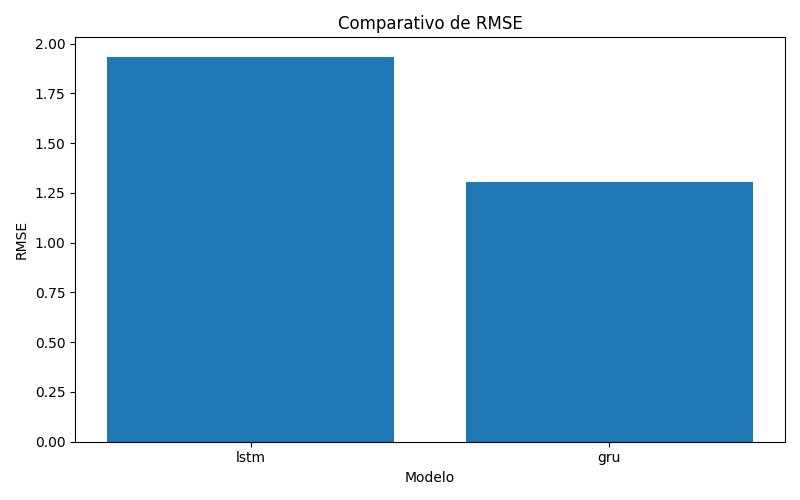
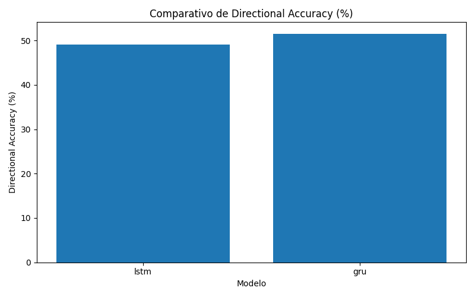
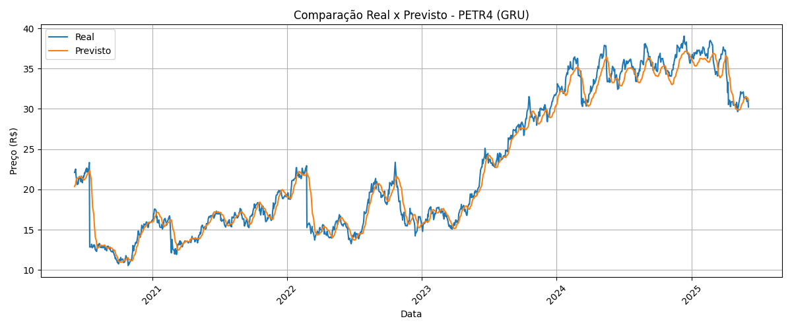
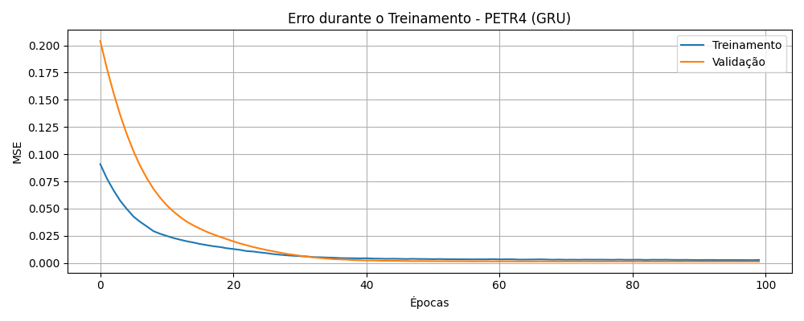
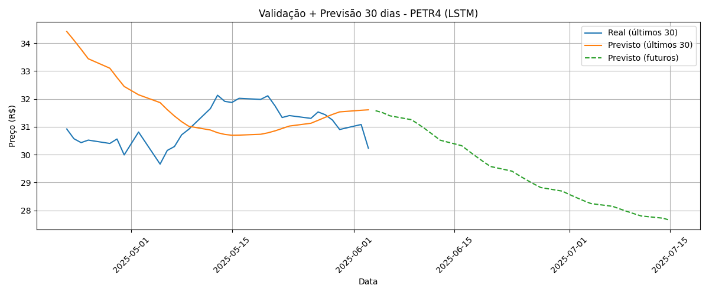
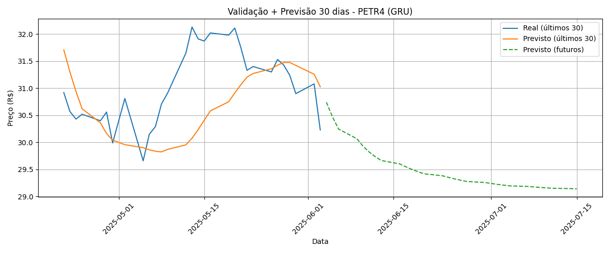

# 📈 Intelligent Stock Predictor (Multivariate LSTM & GRU)

This project aims to forecast the closing prices of Brazilian stocks using multivariate time series processed by deep learning neural networks (LSTM and GRU). The model is trained individually for each asset using historical data obtained from *br.investing.com*. The application features graphical visualizations and an interactive Gradio interface.

---

## ⚠️ DISCLAIMER

This project is for educational and portfolio demonstration purposes only. It does **not** constitute financial advice or recommendations. The predictions and analyses provided by this model should **not** be used as a basis for real-world investment or trading decisions.

All results are intended solely for showcasing data science and machine learning capabilities. The author assumes no responsibility or liability for any losses incurred as a result of using this software. **Always consult a qualified financial advisor before making investment decisions.**

---

## ⚠️ DISCLAIMER

This project is for educational and research purposes only. It does not constitute financial advice or recommendations. Use of the predictions generated by this model in any investment or trading decision is done at your own risk.

The author assumes no responsibility or liability for any losses incurred as a result of using this software. Always consult a qualified financial advisor before making investment decisions.

---

## 🎯 Objective

Develop a modular and intelligent system that:
- Predicts the **next trading day's** closing price based on the past 60 days;
- Compares predictions with actual test data;
- Projects **future trends for 30 business days**;
- Supports interactive usage with CSV file upload via Gradio;
- Is easily auditable and updatable.

---

## 🧠 Model Architecture

### 🔸 Multivariate LSTM & GRU
- **Input Features:**
  - `Closing Price`
  - `Return_%`
  - `MM9` (9-day moving average)
  - `RSI` (Relative Strength Index)
- **Prediction:** Closing price for the next business day
- **Model File:** `model_lstm_multivariado.keras` or `model_gru_multivariado.keras`

The architectures consist of **three sequential LSTM or GRU layers** with progressive Dropouts to avoid overfitting, followed by a final dense layer that outputs the predicted closing price.  
The network is optimized using the **Adam optimizer** with a reduced learning rate to ensure training stability.

---

## 🗂️ Data Source and Updates

- Data was manually obtained from: [Investing.com](https://br.investing.com/)
- ⚙️ **Future Update:** The project is being refactored to use automated data ingestion via APIs (e.g., Alpha Vantage, Twelve Data, or official B3 API) for real-time and continuous data updates. For now, the manually downloaded Investing data is more than sufficient for robust model training and is kept up-to-date for all tests and demonstrations.
- **Note:** For clarity and reproducibility, only the PETR4 stock is showcased in this README. For other assets, please run the program or contact the author.

---

## 📊 Quantitative Results — LSTM vs GRU (PETR4)

Below we demonstrate the performance of both LSTM and GRU architectures using PETR4 as an example.

| Model   |  RMSE   |  MAE   |  MAPE (%) |   R²   |  MedAE  |  Directional_Acc (%) |
|:--------|--------:|-------:|----------:|-------:|--------:|---------------------:|
| **lstm**| 1.93    | 1.42   |    7.03   | 0.95   | 1.08    | 49.03               |
| **gru** | 1.30    | 0.91   |    4.28   | 0.98   | 0.69    | 51.53               |

> Metrics were calculated using the test set (20%) and saved in `results/metricas_modelos.csv`.

---

### 🔹 Comparative Graphs

**RMSE:**  


**MAE:**  


**MAPE:**  


**R²:**  


**Directional Accuracy:**  


---

### 🔹 Actual vs Predicted (PETR4):

- **LSTM:**  
  
- **GRU:**  
  

### 🔹 Training Curves:

- **LSTM:**  
  
- **GRU:**  
  

### 🔮 Future Projections (PETR4):

- **LSTM:**  
  
- **GRU:**  
  

---

## 📦 Project Structure

```
.
├── core/
│   ├── data_preprocessing_multivariado.py
│   ├── model_lstm_multivariado.py
│   ├── model_gru_multivariado.py
│   ├── predictor_multivariado.py
├── data/raw/
├── models/
├── results/
├── utils/
│   └── metrics.py
├── train_multivariado.py
├── comparar_modelo.py
├── validar_e_prever_30_dias.py
├── gerar_metricas_e_graficos.py
├── app.py
├── requirements.txt
├── README.md
```

---

## 🔧 How to Run Locally

1. Clone the repository:
```bash
git clone https://github.com/Iz-castro/intelligent-stock-predictor.git
cd intelligent-stock-predictor
```

2. Create and activate a virtual environment:
```bash
python -m venv venv
source venv/bin/activate  # Linux/Mac
venv\Scripts\activate     # Windows
```

3. Install dependencies:
```bash
pip install -r requirements.txt
```

4. Train the model: (Optional — the training can also be triggered directly from `app.py`)
```bash
python train_multivariado.py
```

5. Generate comparisons and forecasts: (Optional — can also be triggered directly from `app.py`)
```bash
python comparar_modelo.py
python validar_e_prever_30_dias.py
```

6. Launch the interactive app:
```bash
python app.py
```

7. Generate updated metrics and portfolio plots for README:
```bash
python gerar_metricas_e_graficos.py
```

---

## 🌐 Web Application

The project uses **Gradio** to provide an interactive interface for:
- Uploading `.csv` files;
- Training with multiple assets;
- Viewing metrics and charts;
- Making predictions with updated data.

> 💡 Hosting planned for HuggingFace Spaces or Streamlit Cloud.

---

## 📢 Contact & Credits

Developed by **Izael Castro**  
📬 Email: *izaeldecastro@gmail.com*  
🔗 GitHub: [Iz-castro](https://github.com/Iz-castro)  
🔗 LinkedIn: [www.linkedin.com/in/izcastro](https://www.linkedin.com/in/izcastro)

> 🇧🇷 For the Portuguese documentation, see [README_PT-BR.md](README_PT-BR.md)
---

## 📜 License

This project is licensed under the Apache License.  
See the `LICENSE` file for more details.
