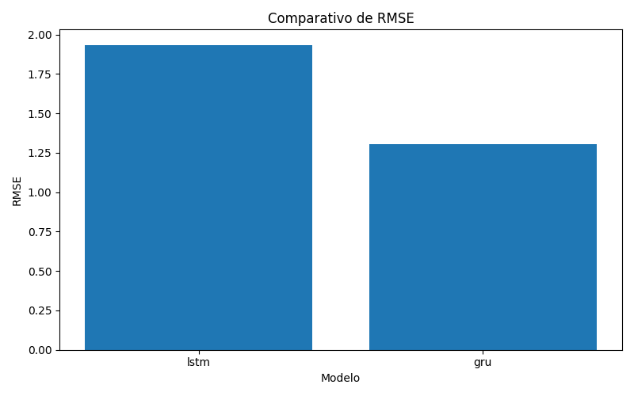
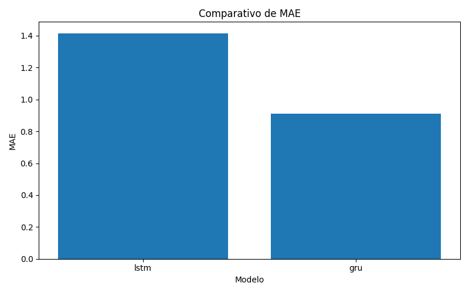
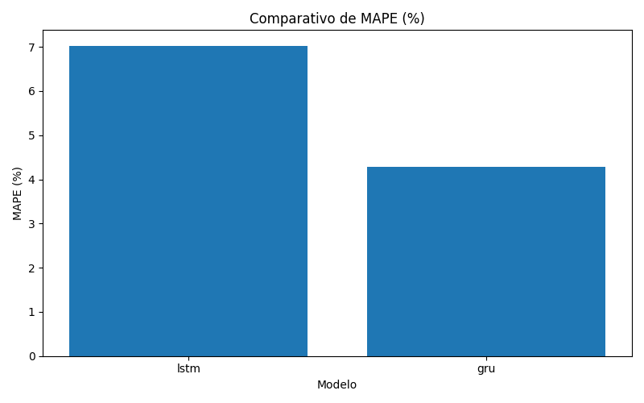
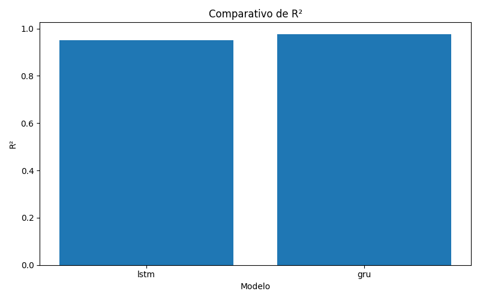
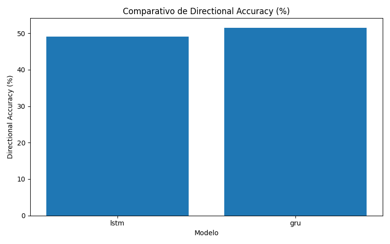
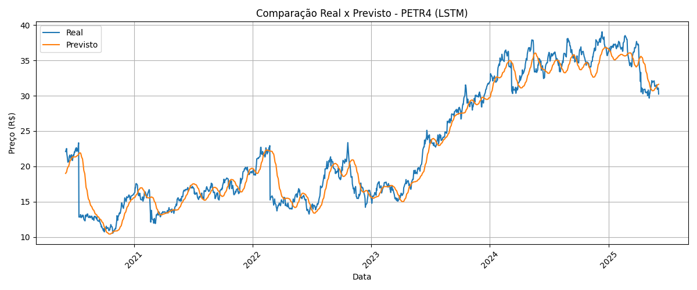
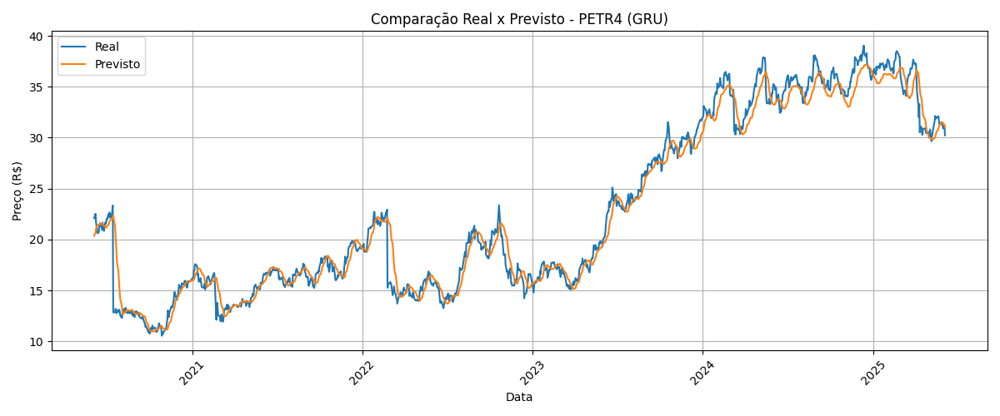
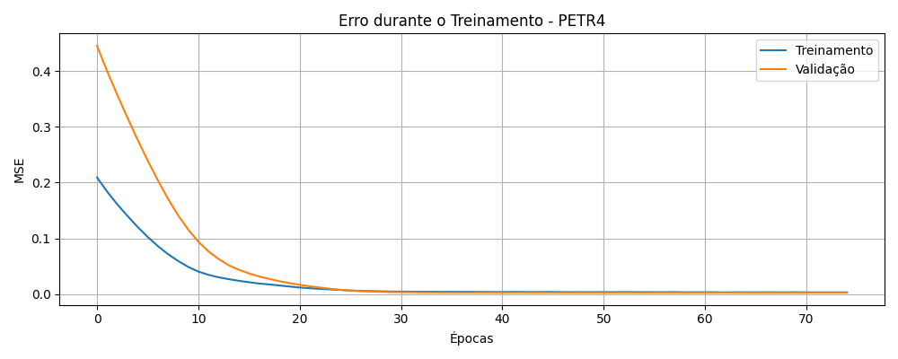
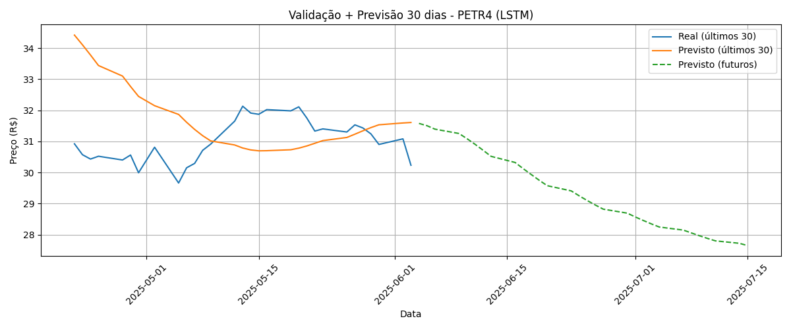
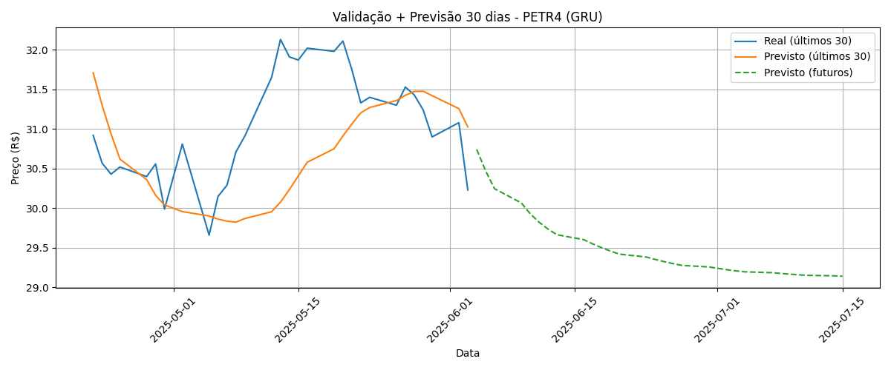

# 📈 Intelligent Stock Predictor (LSTM & GRU Multivariado)

Este projeto tem como objetivo prever o preço de fechamento de ações brasileiras utilizando séries temporais multivariadas processadas por redes neurais profundas do tipo LSTM e GRU. O modelo é treinado individualmente para cada ativo, com dados históricos obtidos do site *br.investing.com*. A aplicação oferece visualizações gráficas e uma interface interativa desenvolvida com Gradio.

---

## ⚠️ AVISO

Este projeto é apenas para fins educacionais e demonstração de portfólio. **Não** constitui recomendação de investimento ou sugestão de compra/venda.  
Os resultados e previsões apresentados são exclusivamente para mostrar habilidades em ciência de dados e machine learning.  
O autor não se responsabiliza por quaisquer perdas decorrentes do uso deste software. **Sempre consulte profissionais qualificados antes de tomar decisões financeiras.**

---

## ⚠️ AVISO LEGAL

Este projeto tem finalidade estritamente educacional e de pesquisa. Não constitui recomendação de investimento nem orientação financeira.

O uso dos resultados ou previsões geradas por este modelo para tomar decisões de compra ou venda de ativos é de inteira responsabilidade do usuário. O autor não se responsabiliza por eventuais perdas financeiras decorrentes do uso deste software. Sempre consulte um profissional habilitado antes de investir.

---

## 🎯 Objetivo

Desenvolver um sistema modular e inteligente que:
- Prediz o **preço de fechamento do próximo pregão** com base nos últimos 60 dias;
- Compara previsões com os dados reais de teste;
- Projeta **tendências futuras para os próximos 30 dias úteis**;
- Permite uso interativo com upload de arquivos CSV via Gradio;
- Seja auditável e facilmente atualizável.

---

## 🧠 Arquitetura dos Modelos

### 🔸 LSTM & GRU Multivariado
- **Features de entrada:**
  - `Fechamento`
  - `Retorno_%`
  - `MM9` (Média Móvel de 9 dias)
  - `RSI` (Índice de Força Relativa)
- **Predição:** Preço de fechamento do próximo dia útil
- **Arquivos dos modelos:** `model_lstm_multivariado.keras` ou `model_gru_multivariado.keras`

As arquiteturas consistem em **três camadas sequenciais de LSTM ou GRU** com Dropouts progressivos para evitar overfitting, seguidas de uma camada densa final que entrega a previsão do preço de fechamento.  
A rede utiliza **otimizador Adam** com taxa de aprendizado reduzida para estabilidade no treinamento.

---

## 🗂️ Fonte dos Dados e Atualizações

- Os dados foram obtidos manualmente em: [Investing.com](https://br.investing.com/)
- ⚙️ **Futuro:** O projeto será atualizado para utilizar APIs automáticas (ex: Alpha Vantage, Twelve Data ou API oficial da B3) para ingestão contínua e em tempo real dos dados.  
  No momento, os dados baixados do Investing são mais do que suficientes para um treino robusto e estão sempre atualizados para fins de teste e demonstração.
- **Nota:** Para fins de documentação clara, exibimos apenas resultados do papel PETR4 neste README. Para outros ativos, execute o programa ou entre em contato com o autor.

---

## 📊 Resultados Quantitativos — LSTM vs GRU (PETR4)

Abaixo apresentamos o desempenho das arquiteturas LSTM e GRU usando PETR4 como exemplo.

| Modelo  |  RMSE   |  MAE   |  MAPE (%) |   R²   |  MedAE  |  Directional_Acc (%) |
|:--------|--------:|-------:|----------:|-------:|--------:|---------------------:|
| **lstm**| 1.93    | 1.42   |    7.03   | 0.95   | 1.08    | 49.03               |
| **gru** | 1.30    | 0.91   |    4.28   | 0.98   | 0.69    | 51.53               |

> As métricas foram calculadas sobre o conjunto de teste (20%) e estão salvas em `results/metricas_modelos.csv`.

---

### 🔹 Gráficos Comparativos

**RMSE:**  


**MAE:**  


**MAPE:**  


**R²:**  


**Directional Accuracy:**  


---

### 🔹 Real vs Previsto (PETR4):

- **LSTM:**  
  
- **GRU:**  
  

### 🔹 Curvas de Treinamento:

- **LSTM:**  
  
- **GRU:**  
  

### 🔮 Projeção Futura (PETR4):

- **LSTM:**  
  
- **GRU:**  
  

---

## 📦 Estrutura do Projeto

```
.
├── core/
│   ├── data_preprocessing_multivariado.py
│   ├── model_lstm_multivariado.py
│   ├── model_gru_multivariado.py
│   ├── predictor_multivariado.py
├── data/raw/
├── models/
├── results/
├── utils/
│   └── metrics.py
├── train_multivariado.py
├── comparar_modelo.py
├── validar_e_prever_30_dias.py
├── gerar_metricas_e_graficos.py
├── app.py
├── requirements.txt
├── README.md
```

---

## 🔧 Como rodar localmente

1. Clone o repositório:
```bash
git clone https://github.com/Iz-castro/intelligent-stock-predictor.git
cd intelligent-stock-predictor
```

2. Crie e ative um ambiente virtual:
```bash
python -m venv venv
source venv/bin/activate  # Linux/Mac
venv\Scripts\activate     # Windows
```

3. Instale as dependências:
```bash
pip install -r requirements.txt
```

<<<<<<< HEAD
4. Treine o modelo: (Opcional — o treino também pode ser feito diretamente no `app.py`)
=======
4. Execute o treinamento: (Opcional — o treinamento também pode ser acionado diretamente no 'app.py')
>>>>>>> 57d9e2a2c21c4900365bdd0359542fbc3c1eec7b
```bash
python train_multivariado.py
```

<<<<<<< HEAD
5. Gere as comparações e previsões: (Opcional — pode ser feito também pelo `app.py`)
=======
5. Gere comparações e previsões: (Opcional — também pode ser acionado diretamente no 'app.py')
>>>>>>> 57d9e2a2c21c4900365bdd0359542fbc3c1eec7b
```bash
python comparar_modelo.py
python validar_e_prever_30_dias.py
```

6. Inicie a interface interativa:
```bash
python app.py
```

7. Gere gráficos e métricas para atualização do portfólio:
```bash
python gerar_metricas_e_graficos.py
```

---

## 🌐 Aplicação Web

O projeto utiliza **Gradio** para disponibilizar uma interface interativa que permite:
- Upload de arquivos `.csv`;
- Treinamento com múltiplos papéis;
- Visualização de métricas e gráficos;
- Previsão de preços com dados atualizados.

> 💡 Planeja-se hospedar futuramente na HuggingFace Spaces ou Streamlit Cloud.

---

## 📢 Contato & Créditos

Desenvolvido por **Izael Castro**  
📬 Email: *izaeldecastro@gmail.com*  
🔗 GitHub: [Iz-castro](https://github.com/Iz-castro)  
🔗 LinkedIn: [www.linkedin.com/in/izcastro](https://www.linkedin.com/in/izcastro)

---

## 📜 Licença

<<<<<<< HEAD
Este projeto está licenciado sob a licença Apache.  
Veja o arquivo `LICENSE` para mais detalhes.
=======
Este projeto está licenciado sob a Licença Apache.  
Consulte o arquivo `LICENSE` para mais detalhes.
>>>>>>> 57d9e2a2c21c4900365bdd0359542fbc3c1eec7b
